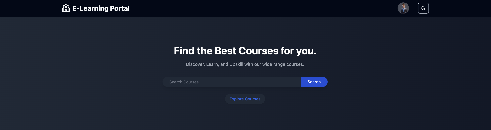
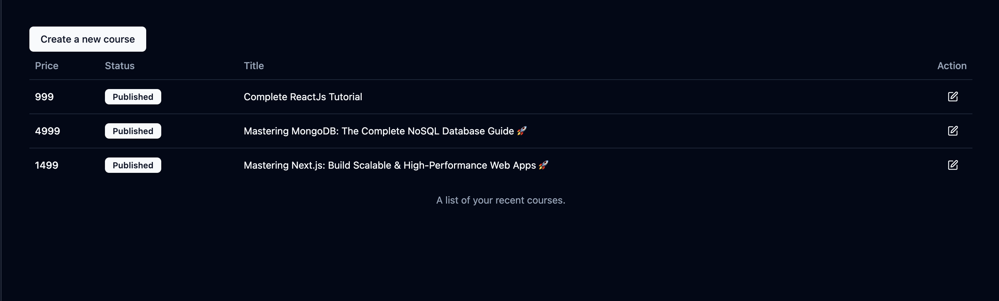

# Learning Management System (LMS)

## Introduction

The frontend of the Learning Management System (LMS) is a web-based platform built with React.js to provide an interactive and user-friendly interface for students and instructors. Users can browse courses, enroll, access learning materials, submit assignments, and track their progress.

## Table of Contents

* Introduction

* Screenshots

* Features

* Technologies Used

* Usage

* License

## Screenshots

1. Landing Page

2. Login Page

3. Signup Page

4. Home Head

5. Home Page

6. My Learning Page

7. Profile

8. Admin Dashboard

9. Course Page

10. Create Course

11. Add Course Data

12. Create Lecture

13. Add Lecture Data

## Features

* User Authentication: Login and registration for students and instructors.

* Course Browsing: Students can view available courses.

* Enrollment System: Students can enroll in courses.

* Interactive UI: Fully responsive design using Tailwind CSS.

* Lesson & Material Display: View course content, videos, and PDFs.

* Assignment & Quiz Submission: Submit assignments and take quizzes.

* Progress Tracking: View enrolled courses and progress.

* Discussion Forum: Engage with instructors and peers.

## Technologies Used

* Frontend: React.js, Redux, Tailwind CSS

* State Management: Redux Toolkit

* Routing: React Router

* Form Handling: React Hook Form & Yup Validation

* API Calls: Axios

## Usage

1. Sign up or log in as a student or instructor.

2. Browse available courses.

3. Enroll in a course to access content.

4. View course materials, submit assignments, and take quizzes.

5. Track progress and engage in discussions.

## License

This project is licensed under the MIT License - see the LICENSE file for details.